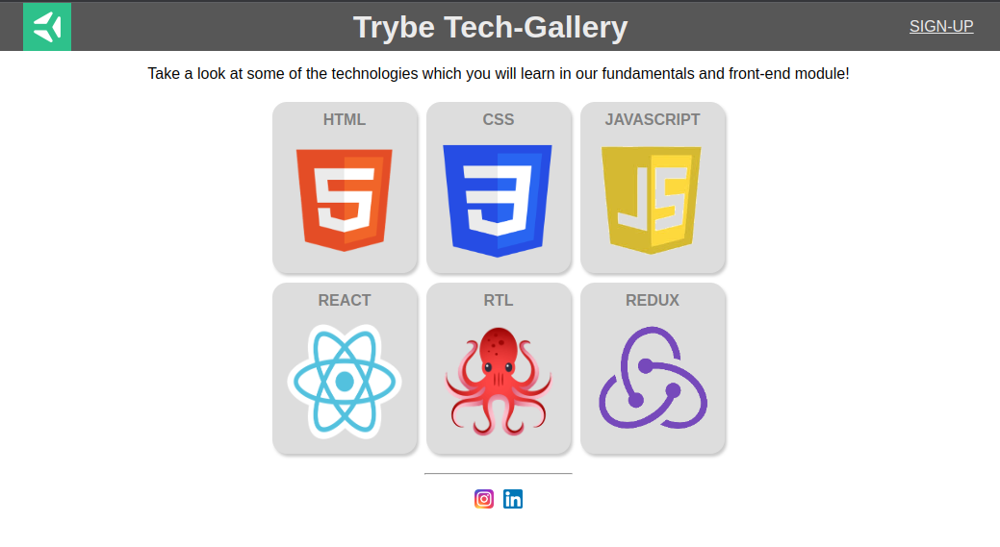

# README: Tech Gallery



[Page link](https://feduarte-dev.github.io/tech-gallery/)

## Project Description

This project was intended to develop my skills in CSS Flexbox. It involved creating a layout with a header, six cards, and a footer, and organizing them using flexbox options.

### Technologies

- LINUX
- VSCODE
- CSS

### What I Learned

- CSS Flexbox properties

## How to Run the Project

1. Clone the repository:

   ```bash
   git clone https://github.com/feduarte-dev/tech-gallery
   ```

2. Navigate to the project directory:

   ```bash
   cd your-repository
   ```

3. Install dependencies:

   ```bash
   npm install
   ```

4. Right click index.html and open it with live server

## Contributions

[Felipe](https://www.linkedin.com/in/feduarte-dev/) - index.html - style.css


[Trybe](https://www.betrybe.com/) - Everything else
